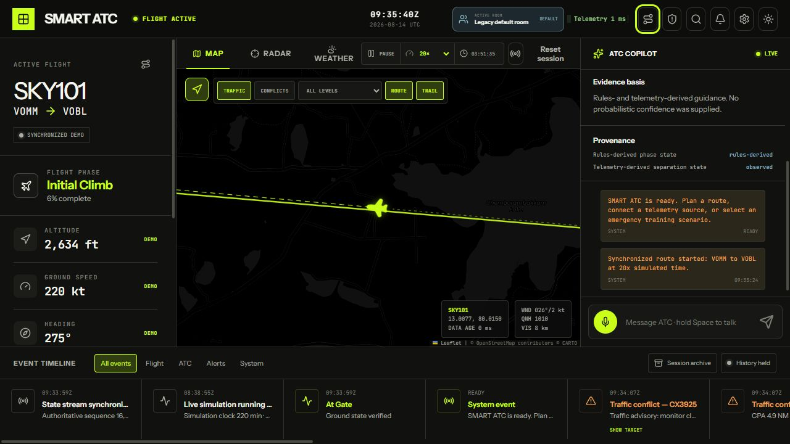
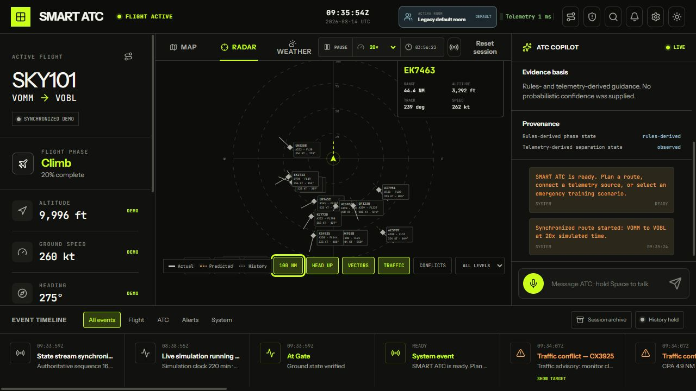
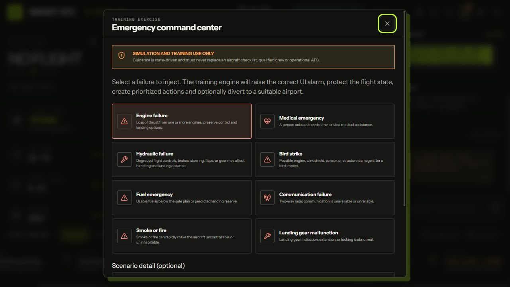
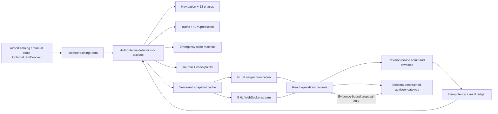

# Smart Air Traffic Control (ATC)

<p align="center">
  
</p>

<p align="center">
  A real-time aviation digital twin and controller-training workspace for synchronized flights, traffic-conflict prediction, structured clearances, and state-driven emergency response.
</p>

<p align="center">
  
  
  
  
  
  
</p>

> [!IMPORTANT]
> Smart ATC is simulation and training software. It is **not certified** for operational air traffic control, dispatch, navigation, flight planning, or real-world emergency decisions.



## Contents

- [Overview](#overview)
- [What is implemented](#what-is-implemented)
- [Product tour](#product-tour)
- [Architecture](#architecture)
- [Technology stack](#technology-stack)
- [Verified engineering evidence](#verified-engineering-evidence)
- [Quick start](#quick-start)
- [Run a local demo](#run-a-local-demo)
- [API and contracts](#api-and-contracts)
- [Verification](#verification)
- [Release-configured containers](#release-configured-containers)
- [Repository layout](#repository-layout)
- [Security and production boundary](#security-and-production-boundary)
- [Project documentation](#project-documentation)
- [Contributing](#contributing)
- [License](#license)

## Overview

Smart ATC models a complete airport-to-airport training flight from one authoritative Python runtime and replicates that state to a modern React operations console at a nominal 5 Hz. The same runtime owns position, heading, altitude, speed, phase, route progress, traffic, weather, clearances, alerts, and emergencies, avoiding the split-brain behavior common in UI-driven simulators.

The platform can run entirely in deterministic demo mode. Ollama, faster-whisper, Edge TTS, and Microsoft Flight Simulator/SimConnect are optional integrations; core routing, radar, conflicts, clearances, emergency workflows, and text fallback continue to work when those services are unavailable.

## What is implemented

| Area | Current capability |
| --- | --- |
| Flight engine | Geodesic airport-to-airport routes, synchronized kinematics, fuel and ETA tracking, and 13 deterministic phases from gate to landing |
| State replication | Identical REST/WebSocket snapshots, 5 Hz delivery, session and sequence gates, semantic revisions, gap resync, stale-data detection, and provenance |
| Training rooms | Isolated runtime, route, weather, traffic, clearances, emergencies, event journal, command ledger, and model history per room |
| Surveillance | Deterministic traffic generation, closest-point-of-approach prediction, conflict severity, vectors, trails, filtering, and linked target selection |
| Emergency training | Eight injectable emergency types, performance effects, squawk changes, diversion guidance, prioritized actions, alerts, and guarded resolution |
| Clearances | Structured altitude, heading, speed, direct-to, taxi, hold, takeoff, landing, frequency, and squawk instructions with validated readback before execution |
| Advisory layer | Local LLM chat and a schema-constrained gateway with allowlisted reads, proposal-only actions, evidence/provenance binding, expiry, and revalidation |
| Voice | Press-and-hold PTT, faster-whisper speech recognition, Edge TTS, deterministic text fallback, and configurable input/output devices |
| Operations UI | Responsive map, sector radar, weather view, command palette, alert center, emergency coach, event timeline, session archive, and accessibility support |
| Audit and replay | Bounded semantic journal, checksummed checkpoints, read-only retained replay, bookmarks, JSON export, idempotent command receipts, and audit lookup |
| Offline safety | Installable PWA shell with complete static precaching; offline or stale clients become read-only and never queue operational mutations |

The exact delivered inventory is maintained in [IMPLEMENTED_FEATURES.md](IMPLEMENTED_FEATURES.md).

## Product tour

### Sector radar and conflict prediction



The radar supports 10/25/50/100 NM ranges, north-up and head-up orientation, altitude filters, history and predicted vectors, selected-track data, conflict styling, and closest-point-of-approach guidance.

### State-driven emergency command center



Emergency exercises cover engine failure, medical emergency, hydraulic failure, bird strike, fuel emergency, communication failure, smoke/fire, and landing-gear malfunction. The backend, not the browser, owns emergency state and resolution criteria.

### Takeoff-to-console entrance


The automatic entrance uses a straight runway takeoff, restrained trails, synchronized cabin/engine sound, and a shared aircraft-to-radar transition into the live console.

## Architecture



### State and command safety

- Reads never advance simulation physics.
- Every snapshot includes a runtime session ID, transport sequence, semantic `state_revision`, observation time, source, and data age.
- Protected mutations carry command and idempotency IDs, expected state, actor, issue time, and expiry.
- Heartbeat sequences may advance without invalidating a command; a true semantic change advances the revision and produces a conflict instead of a silent overwrite.
- Model output can explain or propose an action, but cannot directly mutate aircraft state or resolve an emergency.
- Clearances alter targets only after an accepted, validated pilot readback.

## Technology stack

| Layer | Technologies |
| --- | --- |
| Frontend | React 19, TypeScript 6, Vite 8, Leaflet/React Leaflet, Lucide, Web Audio, MediaRecorder/MediaDevices, HTML audio output routing, service worker |
| Backend | Python 3.12, FastAPI, Pydantic 2, Uvicorn, HTTPX, REST, WebSockets |
| Intelligence and voice | Ollama chat, separate schema-constrained advisory tool gateway, deterministic ATC fallback, faster-whisper, Edge TTS |
| Simulator integration | Optional SimConnect connector for Microsoft Flight Simulator; deterministic demo runtime by default |
| Delivery | Docker Compose, Nginx, non-root containers, health/readiness probes, PowerShell automation, GitHub Actions, Dependabot |
| Quality | Pytest, ESLint, TypeScript project builds, OpenAPI 3.1 contract generation, compatibility drift checks, deterministic benchmark gates |

## Verified engineering evidence

These are reproducible local results committed with the project, not projected performance percentages or public-production capacity claims.

| Evidence | Verified result |
| --- | ---: |
| Backend automated tests | 135 passing |
| Versioned contract surface | 56 HTTP operations, 76 models, 1 WebSocket channel |
| Nominal state delivery | 5 Hz / 200 ms |
| Fixed-step benchmark | 8 isolated rooms x 300 ticks = 2,400 snapshots |
| Local in-process throughput | 1,104.15 snapshots/s |
| Snapshot latency p50 / p95 / p99 | 0.754 / 1.485 / 2.408 ms |
| Deterministic / room-isolation divergence | 0 / 0 checksum divergences |
| Full-route benchmark | VOMM to VABB, 558.03 NM, 225 ticks |
| Flight-phase coverage | 13 of 13 phases |
| Final route position error | 0.000 NM |
| Concurrent retry test | 100 requests, 1 mutation, 99 deduplicated, 0 duplicate mutations |
| Advisory-gateway baseline | 16 allow, reject, and revalidation cases |

The benchmark is an in-process, single-machine Python harness. It excludes HTTP/WebSocket transport, external networking, durable storage, multi-process scheduling, and deployed infrastructure overhead. See [docs/BENCHMARKS.md](docs/BENCHMARKS.md) for the method and limitations.

## Quick start

### Prerequisites

- Python 3.11 or newer (Python 3.12 is used in CI and containers)
- Node.js 22 or newer with npm
- Optional: Docker Desktop, Ollama, faster-whisper/Edge TTS dependencies, and SimConnect on Windows

### Windows: automated setup

```powershell
Set-ExecutionPolicy Bypass -Scope Process -Force
.\setup.ps1
```

The script creates `.venv`, installs locked frontend dependencies and selected backend extras, verifies the frontend build, starts both services, and opens the console.

Useful variants:

```powershell
.\setup.ps1 -NoLaunch
.\setup.ps1 -SkipAI -SkipSimConnect
```

### Manual setup: Windows PowerShell

```powershell
python -m venv .venv
.\.venv\Scripts\Activate.ps1
python -m pip install --upgrade pip
python -m pip install -r backend\requirements-dev.txt
# Optional voice/model support:
python -m pip install -r backend\requirements-ai.txt

Set-Location frontend
npm ci
Set-Location ..
```

### Manual setup: Linux or macOS

```bash
python3 -m venv .venv
source .venv/bin/activate
python -m pip install --upgrade pip
python -m pip install -r backend/requirements-dev.txt
# Optional voice/model support:
python -m pip install -r backend/requirements-ai.txt

(cd frontend && npm ci)
```

Start the API from the repository root:

```bash
python -m uvicorn backend.main:app --reload --host 127.0.0.1 --port 8000
```

Start the UI in a second terminal:

```bash
cd frontend
npm run dev
```

Open:

- Operations console: <http://127.0.0.1:5173>
- Interactive API documentation: <http://127.0.0.1:8000/docs>
- Readiness endpoint: <http://127.0.0.1:8000/ready>

The deterministic fallback requires no model service. To enable local model responses, run Ollama separately and configure `OLLAMA_URL` and `OLLAMA_MODEL` from [.env.example](.env.example).

## Run a local demo

1. Open the training-room lobby and create or join an isolated room.
2. Plan VOMM to VOBL, VOMM to VABB, or another catalog route; manual coordinates are accepted for an unknown ICAO.
3. Start the synchronized demo and move between map, radar, and weather views.
4. Change time scale, pause/resume the authoritative clock, and inspect live sequence/revision behavior.
5. Select nearby traffic and review its projected closest point of approach.
6. Inject an emergency, acknowledge its alert, complete the staged actions, and satisfy the backend resolution criteria.
7. Inspect the session archive, create a bookmark, and export the retained JSON journal.

## API and contracts

The current API schema version is `3.0.0`. The committed [OpenAPI document](contracts/openapi.json) and [compatibility manifest](contracts/manifest.json) cover 56 HTTP operations, 76 Pydantic models, and the `/ws/state` channel.

Primary surfaces:

- `/training-sessions` - isolated room lifecycle, keepalive, quotas, and selectors
- `/sim/state` and `/ws/state` - identical authoritative state snapshots
- `/routes`, `/scenario`, `/emergencies`, `/alerts`, `/clearances`, and `/commands` - operational workflows and audit receipts
- `/sessions` - event history, replay ranges, checkpoints, bookmarks, and export
- `/ai/gateway` - allowlisted reads, proposal-only tools, policy, revalidation, and offline evaluation metrics
- `/chat`, `/stt`, and `/tts` - optional text and voice communication services
- `/health` and `/ready` - runtime health and deployment readiness

Production mode requires a whitespace-free ASCII service key of at least 43 characters (the encoded size of 32 random bytes). HTTP and WebSocket authentication is header-only through `X-API-Key`; browser clients should reach the API through the same-origin Nginx proxy so the credential is never embedded in frontend source or a URL.

## Verification

Run the local readiness doctor and complete verification pipeline:

```powershell
.\scripts\doctor.ps1 -CheckOllama
.\scripts\verify.ps1
```

Individual gates:

```powershell
# Backend compile, contracts, tests, and benchmark
$env:PYTHONPATH = "$PWD\backend"
python -m compileall -q backend
python scripts\generate_contracts.py --check
python -m pytest -q backend\tests
python scripts\benchmark_backend.py --quick --check

# Frontend
Set-Location frontend
npm run lint
npm run build
```

GitHub Actions executes the backend, frontend, contract, benchmark, and container-build gates on pushes and pull requests.

## Release-configured containers

This command creates a release-configured **local** stack without publishing it:

```powershell
.\scripts\start-release.ps1 -Build
```

Open <http://127.0.0.1:8080>, then stop the stack with:

```powershell
.\scripts\stop-release.ps1
```

The launcher creates an in-memory service credential for the process and does not write it to disk. See [docs/RELEASE.md](docs/RELEASE.md) before moving the images to any external environment.

## Repository layout

```text
.
|-- backend/                 FastAPI application, deterministic runtime, gateway, journal, ledger, tests
|-- frontend/                React/TypeScript PWA operations console
|-- contracts/               Generated OpenAPI and compatibility manifest
|-- benchmarks/              Committed local benchmark baseline
|-- deploy/                  Nginx release template
|-- docs/                    Benchmark/release guides and real application screenshots
|-- scripts/                 Doctor, verification, contract, benchmark, and release automation
|-- .github/                 CI, dependency updates, issue forms, and pull-request template
|-- docker-compose.yml       Local container topology
|-- docker-compose.release.yml  Hardened local release overlay
`-- setup.ps1                Windows setup and launch entry point
```

## Security and production boundary

No real credentials belong in this repository. Local `.env` files, virtual environments, build output, logs, model caches, and verification runtimes are ignored. Public examples contain placeholders only.

The repository includes API-key enforcement for production mode, host/origin restrictions, request limits, Nginx security headers, non-root containers, read-only filesystems, health checks, dependency automation, and CI. It is still a local training platform, not a public multi-tenant service.

Before external deployment, add:

- OIDC authentication and role-based authorization
- PostgreSQL/PostGIS persistence and schema migrations
- managed secrets, TLS, backups, restore drills, and key rotation
- licensed navigation, weather, terrain, and aircraft-performance data
- OpenTelemetry traces/metrics/logs and alerting tied to SLOs
- privacy/retention controls for audio, transcripts, and session exports
- independent security, accessibility, load, failover, and recovery validation

In-memory rooms, journals, command receipts, and alert acknowledgements do not survive a backend process restart. Read [SECURITY.md](SECURITY.md) before reporting or deploying security-sensitive changes.

## Project documentation

- [Implemented feature inventory](IMPLEMENTED_FEATURES.md) - exactly 50 capabilities present in the repository
- [Implementation status](FEATURE_IMPLEMENTATION_STATUS.md) - honest mapping of implemented, foundation, and planned work
- [Feature launch plan](FEATURE_LAUNCH_PLAN.md) - phased roadmap for the next 50 production-oriented capabilities
- [Production roadmap](PRODUCTION_ROADMAP.md) - architecture and operational maturity plan
- [Benchmark methodology](docs/BENCHMARKS.md) - reproducible evidence and limitations
- [Release runbook](docs/RELEASE.md) - local release stack and external-deployment checklist
- [Contributing guide](CONTRIBUTING.md) - development workflow and quality gates

## Contributing

Issues and pull requests are welcome. Start with [CONTRIBUTING.md](CONTRIBUTING.md), keep safety-relevant state changes deterministic and backend-authoritative, add tests for behavioral changes, and run the verification pipeline before opening a pull request.

## License

Released under the [MIT License](LICENSE).
