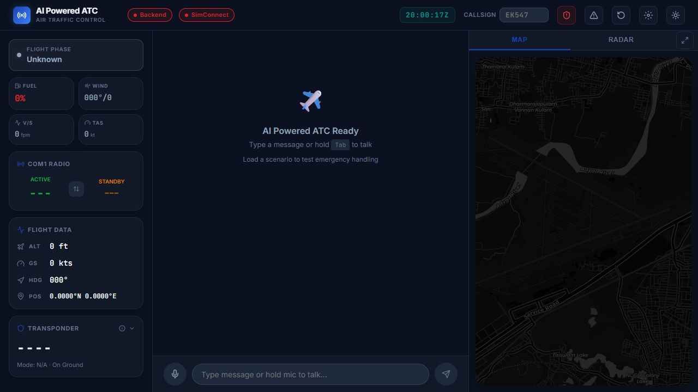
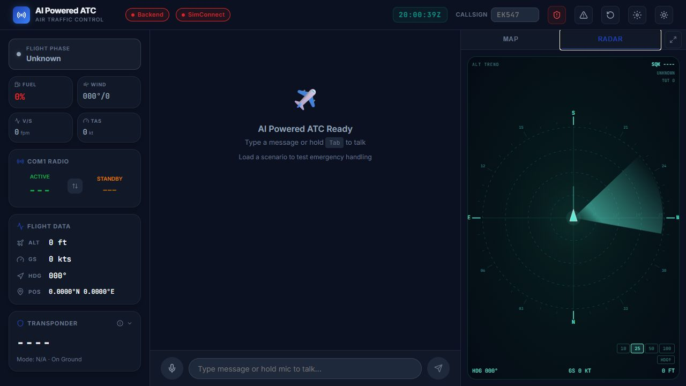
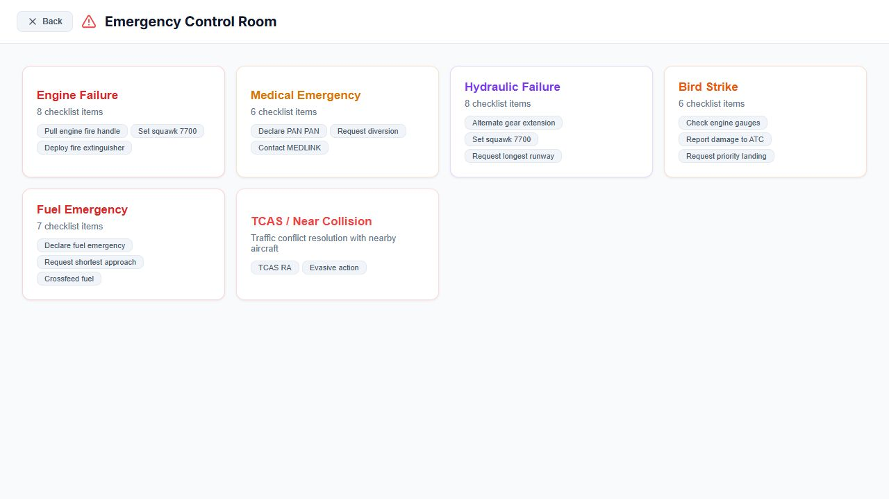
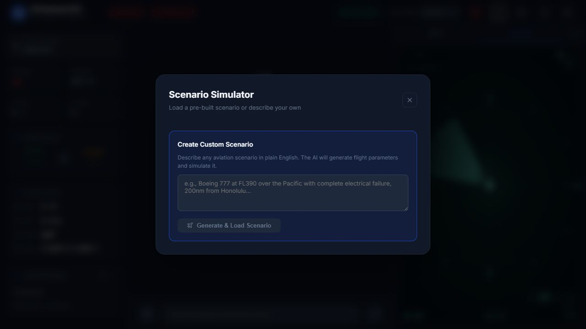
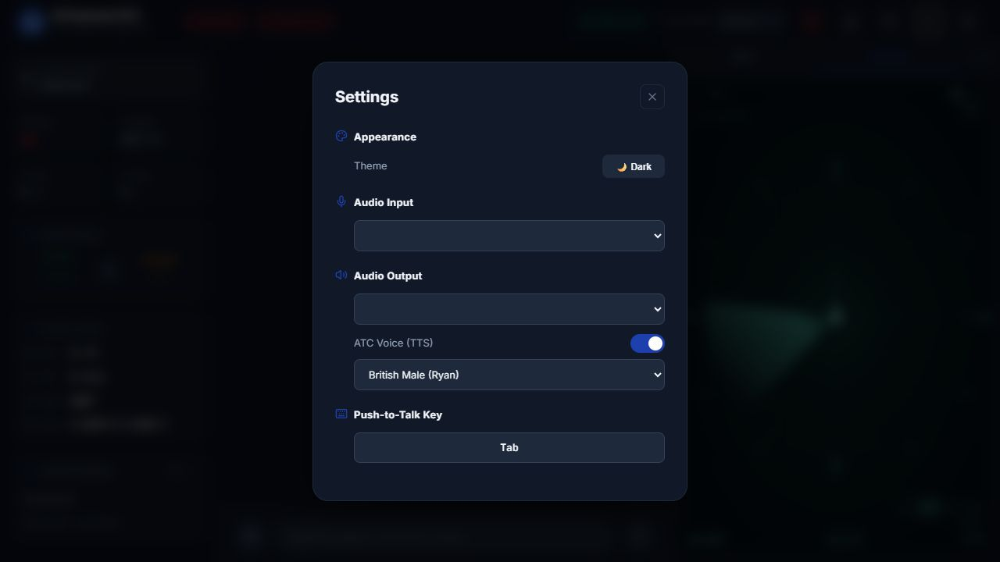
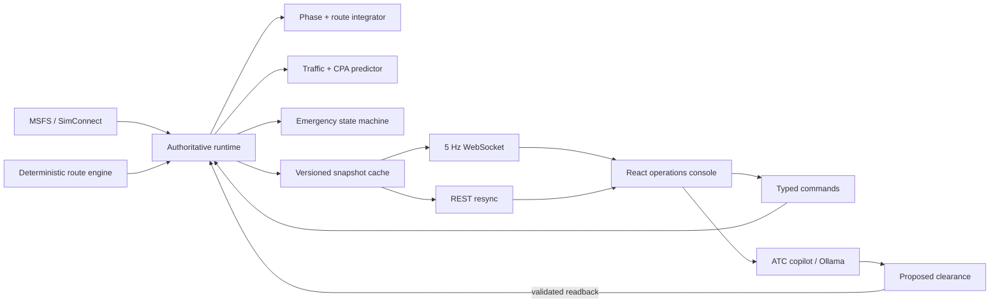

# SkyCommand


SkyCommand is an AI-assisted air-traffic-control and flight-operations training simulator. It combines a deterministic flight engine, sequenced telemetry, predictive traffic monitoring, structured emergency workflows, radio-style AI interaction, a geographic map, and a sector radar in one cockpit console.

> SkyCommand is for simulation, education, portfolio demonstrations, and software research. It is not certified or suitable for operational ATC, dispatch, navigation, or real-world emergency decisions.

## What it does

- Runs a complete airport-to-airport demo from any cataloged ICAO pair, or from manually supplied coordinates.
- Progresses through gate, pushback, taxi, hold-short, takeoff, climb, cruise, descent, approach, landing, and landed phases.
- Keeps position, bearing, heading, altitude, speed, vertical rate, fuel, ETA, phase, route progress, and UI state synchronized to one authoritative simulation clock.
- Streams versioned snapshots at 5 Hz over WebSocket, with REST resynchronization, session IDs, monotonic sequences, source metadata, data age, stale-state detection, and out-of-order rejection.
- Predicts traffic conflicts using closest-point-of-approach geometry and displays actual, historical, and projected radar vectors.
- Simulates engine, medical, hydraulic, bird-strike, fuel, communications, smoke/fire, and landing-gear emergencies.
- Creates prioritized stabilize/navigate/communicate/divert/land actions, suitable-airport diversion guidance, alerts, squawk changes, and explicit resolution gates.
- Treats AI as a copilot and communication layer. Deterministic code owns kinematics, phase transitions, conflicts, clearances, and emergency state.
- Requires an explicit pilot readback before an issued clearance can mutate flight targets.
- Supports keyboard or press-and-hold PTT, speech-to-text, text-to-speech, selectable voices/devices, an opt-in cabin chime, and a reduced-motion intro.

## Screenshots

### Operations console

The main cockpit console pairs a live flight-data sidebar (phase, fuel, wind, vertical speed, TAS, COM1 radio, transponder) with an AI radio channel in the center and a switchable map/radar panel on the right. Type a message or hold `Tab` to talk over push-to-talk.



### Sector radar

The radar view renders a classic sweep display with range rings, compass rose, selectable range scale (10/25/50/100 NM), heading and ground-speed readouts, and squawk/altitude trend data. Traffic conflicts predicted by the CPA engine are projected directly onto the scope.



### Emergency control room

Each emergency type (engine failure, medical, hydraulic, bird strike, fuel, TCAS/near collision, and more) ships with a structured checklist: squawk changes, declarations, diversion requests, and resolution gates that must be explicitly acknowledged.



### Scenario launcher and settings





## Architecture



The critical rule is simple: reads never advance the simulation and AI text never directly changes aircraft state. State changes enter through typed, validated command endpoints.

## Quick start on Windows

```powershell
Set-ExecutionPolicy Bypass -Scope Process -Force
.\setup.ps1
```

Useful setup switches:

```powershell
.\setup.ps1 -SkipAI -SkipSimConnect
.\setup.ps1 -NoLaunch
```

Manual development start:

```powershell
python -m venv .venv
.\.venv\Scripts\python.exe -m pip install -r backend\requirements.txt
cd frontend
npm ci
npm run dev
```

In a second terminal:

```powershell
.\.venv\Scripts\python.exe -m uvicorn backend.main:app --host 127.0.0.1 --port 8000
```

Open `http://127.0.0.1:5173`. API documentation is at `http://127.0.0.1:8000/docs`.

## Verification

```powershell
cd frontend
npm run lint
npm run build

cd ..
$env:PYTHONPATH="$PWD\backend"
.\.venv\Scripts\python.exe -m pytest -q backend\tests
```

The current revamp passes the complete frontend typecheck/lint/build and all 28 backend tests. The backend suite covers HTTP/WebSocket contracts, snapshot sequencing, full-route completion, phase transitions, clearances, aviation-number parsing, emergencies, and CPA conflicts.

## Main API surfaces

- `GET /sim/state`, `WS /ws/state` — identical authoritative snapshot contract.
- `GET /airports/search`, `GET /airports/{icao}` — airport catalog and manual-coordinate fallback support.
- `POST /routes/demo` — create and optionally engage a synchronized route.
- `POST /routes/{id}/engage|cancel` — explicit route lifecycle.
- `POST /emergencies/activate` — deterministic emergency injection.
- `POST /emergencies/{id}/actions/{action}/complete` — checklist acknowledgement.
- `POST /emergencies/{id}/resolve` — guarded resolution after criteria are satisfied.
- `POST /chat` — AI/rules ATC response; may propose but never silently execute a clearance.
- `POST /clearances/{id}/accept` — validated pilot readback and target execution.
- `POST /stt`, `POST /tts` — optional voice services.

## Production configuration

Copy `.env.example` and set explicit hosts, origins, and secrets. `ATC_API_KEY` is mandatory when `ATC_ENV=production`. For a public browser application, put the API behind an OIDC-aware gateway rather than embedding a permanent API key in frontend code.

See [PRODUCTION_ROADMAP.md](./PRODUCTION_ROADMAP.md) for the scale, data, AI, observability, security, and open-source plan.

## License

Released under the [MIT License](./LICENSE).
